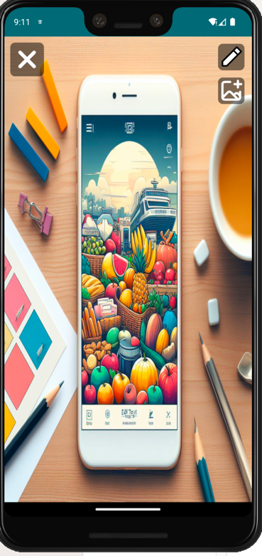
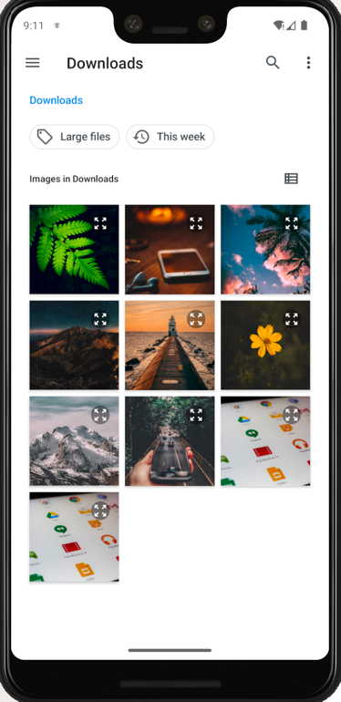
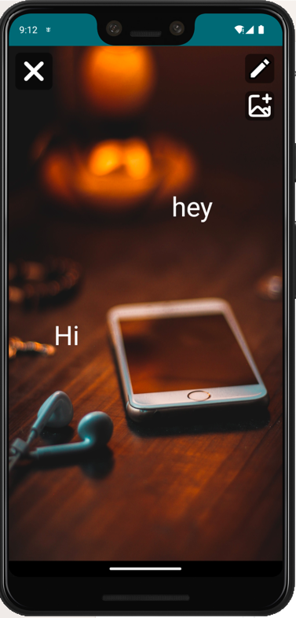

# ImageEditor
And app that provides to the user the ability of pick some image and put some text there, created with kotlin, koin, and the gesture api from android

Demo video:
https://drive.google.com/file/d/1ue4Yr3jS9MwUs1HgvD25u_gz9z6Zl-_W/view?usp=sharing

Images:

  
  
  

